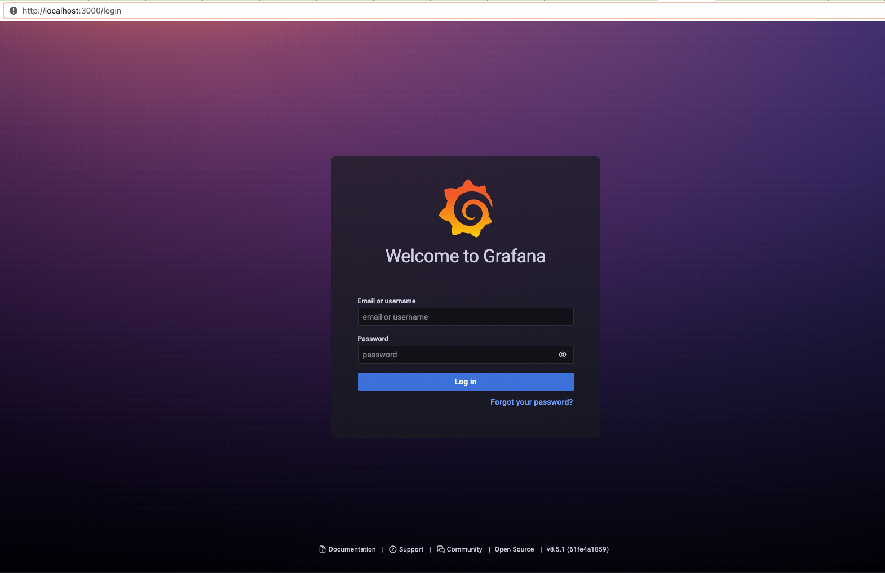

# Monitor With Grafana

## Install Grafana
Follow the documentation on [official website](https://grafana.com/docs/grafana/latest/installation/docker/)

I will use opensource version docker image on my macbook. run:

```sh
# enterprise version
docker run -d -p 3000:3000 grafana/grafana-enterprise

# open source version
docker run -d -p 3000:3000 grafana/grafana-oss
```

the default port is 3000, we can see the index page on localhost:3000


the default usename and password are both `admin`, it will let us to change the password

## Use Grafana Worldmap Panel as example

worldmap is not a out-of-box plugin, you have to install it.

while you can follow https://www.metricfire.com/blog/grafana-worldmap-panel/ to install it using command line, I use the GUI:

1. click `configuration` -> `plugins`
2. search world map
3. install `Worldmap Panel`


